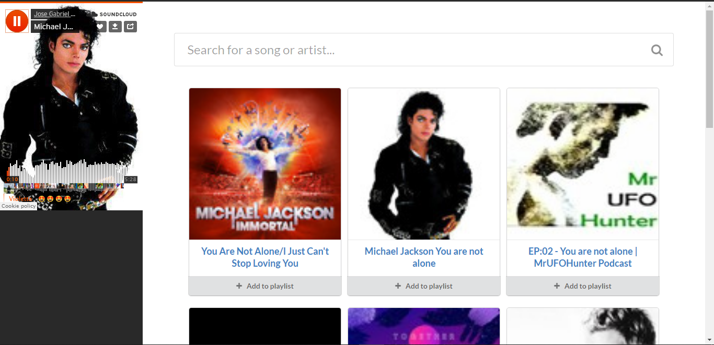

# Sound Cloud Player
Sound Cloud Player is an embedded player that let's you search for a song and add it to your playlist to hear and enjoy the music. 

# General Info
Search for a song using the search bar. All the relevant results related to the searched song will be displayed as grids. 
Choose a song and click "Add to Playlist" to play it. 
If you wish to download the song, just click on it and it will direct you to the soundcloud platform. 
You can add as many songs as you wish in the playlist. 
Though you close the page and open it again, the added songs in the playlist remains the same and it will not be erased. 

# Technologies
1. Semantic UI
2. Sound Cloud API

# Screenshot

